<div align="center">


<br/>

<a href="https://hemasamir.github.io"></a>
<a href="https://wa.me/201055673184"></a>
<a href="mailto:01055673184hs@gmail.com"></a>

<br/>


</div>

---

<div dir="rtl">

## ✨ عن الموقع

بورتفوليو شخصي لـ **م. إبراهيم سمير** — مطوّر تطبيقات موبايل ومواقع (Flutter و Next.js).
بيعرض **أكتر من 35 مشروع** بين تطبيقات منشورة على App Store و Google Play، ومواقع ومتاجر، وأنظمة ذكية — بصور وتفاصيل كل مشروع، وطريقة سهلة للعميل إنه يتواصل ويبدأ مشروعه على طول.

</div>

<p align="center">
  <a href="https://hemasamir.github.io">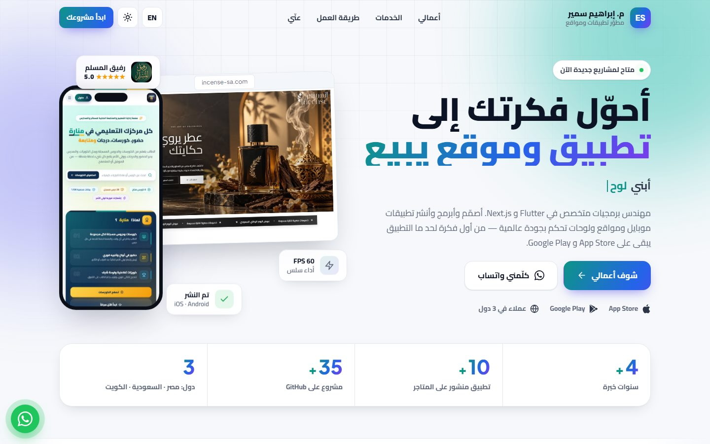</a>
  <a href="https://hemasamir.github.io/?lang=en&theme=dark">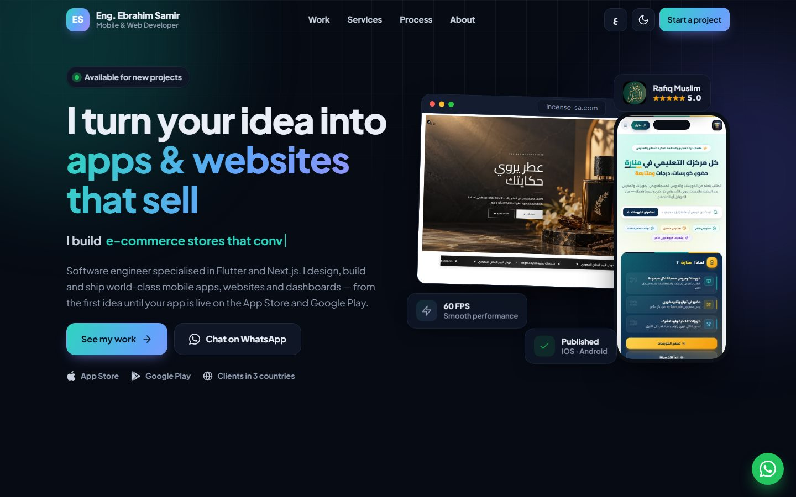</a>
</p>
<p align="center"><sub>الوضع الفاتح بالعربي &nbsp;•&nbsp; Dark mode in English</sub></p>

---

## 🚀 Highlights · المميزات

| | |
|---|---|
| 🌍 **عربي / English** | تبديل فوري للغة مع قلب اتجاه الصفحة (RTL / LTR) — وتقدر تبعت رابط إنجليزي مباشر: `?lang=en` |
| 🌗 **Light / Dark** | بيتبع إعداد جهاز الزائر تلقائياً وبيفتكر اختياره — أو `?theme=dark` |
| 🖼️ **معرض بصور حقيقية** | سكرينشوتات من App Store ومن الريبوهات ولقطات من المواقع اللايف، داخل موبايلات وشاشات متصممة |
| 🔎 **فلترة المشاريع** | الكل · موبايل · مواقع ومتاجر · منشور ولايف · أنظمة وذكاء اصطناعي · تدريبات و UI |
| 🪟 **صفحة تفاصيل لكل مشروع** | معرض صور بالأسهم والسحب على الموبايل، المميزات، التقنيات، وروابط المتاجر والكود |
| 🎞️ **حيطة مشاريع متحركة** | صفين من أغلفة المشاريع بيتحركوا عكس بعض |
| 💬 **تواصل بضغطة** | فورم بيفتح رسالة جاهزة على واتساب + زرار واتساب عائم |
| 📱 **متجاوب بالكامل** | مظبوط على الموبايل والتابلت والكمبيوتر |
| ⚡ **خفيف وسريع** | HTML + CSS + JS بدون أي framework أو build — صور مضغوطة و lazy loading |
| ♿ **Accessible** | دعم الكيبورد، `prefers-reduced-motion`، وتباين ألوان واضح |

<p align="center">
  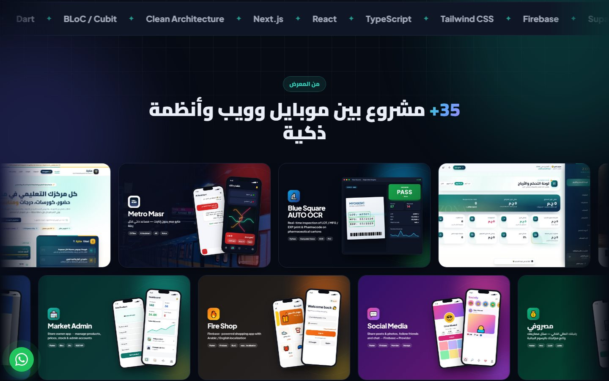
  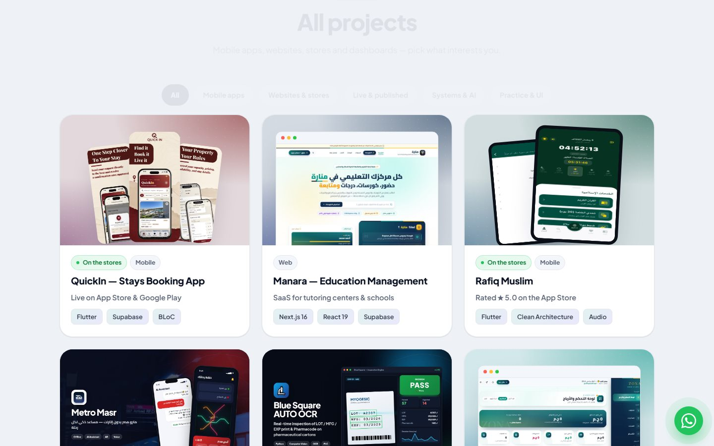
</p>
<p align="center">
  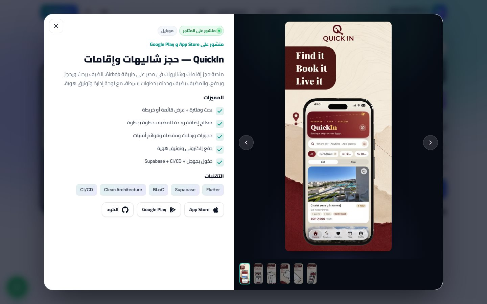
</p>

---

## 🏆 Featured projects · أبرز الأعمال

<table>
<tr>
<td width="50%" valign="top">
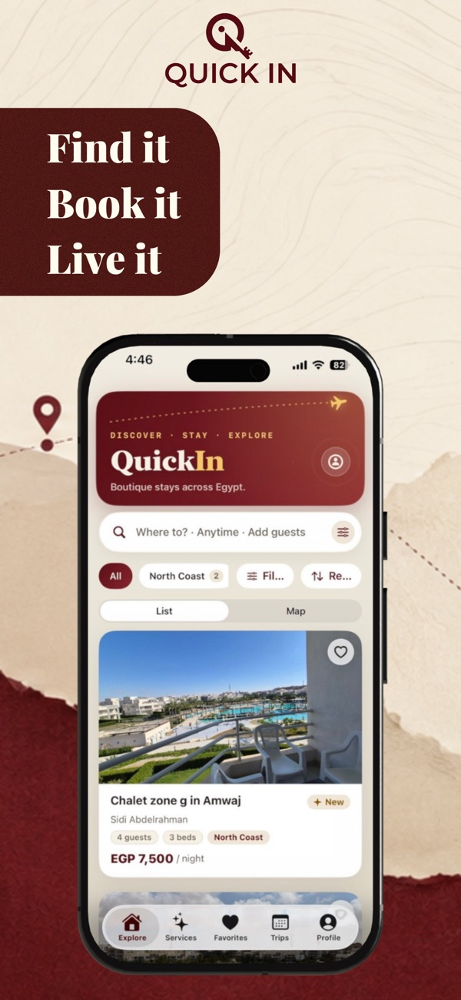

**QuickIn** — حجز شاليهات وإقامات
<br/><sub>Airbnb-style booking · Flutter · Supabase · CI/CD</sub>
<br/><br/>
<a href="https://apps.apple.com/us/app/quickin-app/id6778979967"></a>
<a href="https://play.google.com/store/apps/details?id=com.quickin.app"></a>
</td>
<td width="50%" valign="top">


**رفيق المسلم · Rafiq Muslim** ⭐ 5.0
<br/><sub>Prayer times · Quran audio · Azkar · Flutter</sub>
<br/><br/>
<a href="https://apps.apple.com/jm/app/rafiq-muslim-%D8%B1%D9%81%D9%8A%D9%82-%D8%A7%D9%84%D9%85-%D8%B3%D9%84%D9%85/id6759332192"></a>
<a href="https://play.google.com/store/apps/details?id=com.rafiq.muslim"></a>
</td>
</tr>
<tr>
<td colspan="2">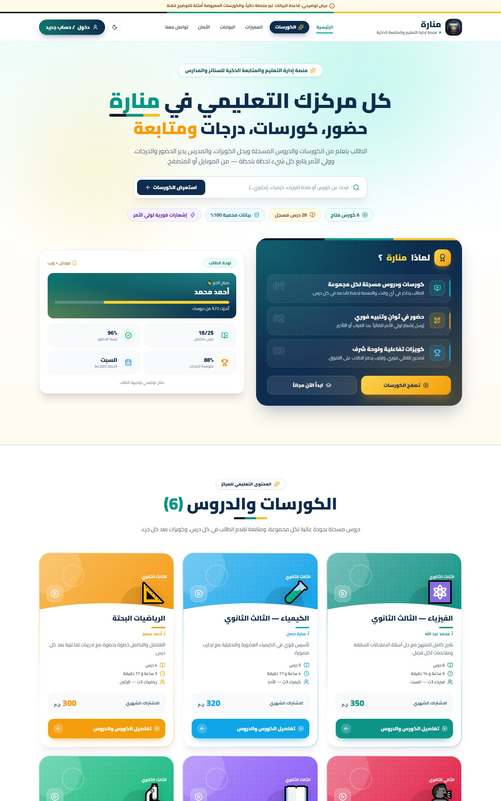<br/>

**منارة · Manara** — منصة إدارة تعليمية للسناتر والمدارس بـ 5 بوابات (إدارة · مدرس · مساعد · طالب · ولي أمر)، حضور بالـ QR، كويزات، مالية وتقارير — <sub>Next.js 16 · Supabase Realtime · RLS</sub>
</td>
</tr>
<tr>
<td width="50%">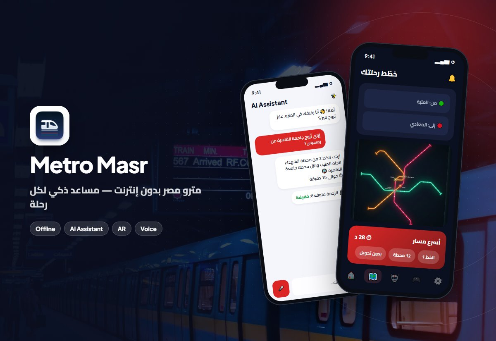<br/>

**مترو مصر بدون إنترنت** — مساعد ذكاء اصطناعي، توقع الزحمة، أوامر صوتية و AR
<br/><a href="https://apps.apple.com/us/app/%D9%85%D8%AA%D8%B1%D9%88-%D9%85%D8%B5%D8%B1-%D8%A8%D8%AF%D9%88%D9%86-%D8%A7%D9%86%D8%AA%D8%B1%D9%86%D8%AA/id6782100362"></a>
</td>
<td width="50%">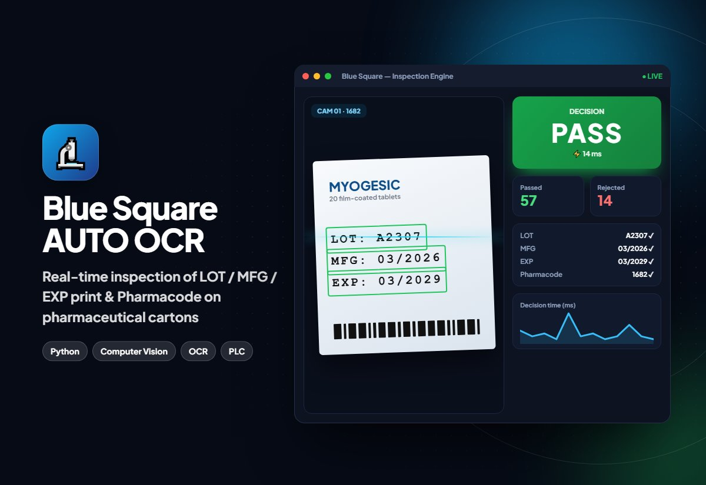<br/>

**Blue Square AUTO OCR** — فحص طباعة علب الأدوية بالكاميرا لحظياً على خط الإنتاج (~14 ms) مع رفض تلقائي عبر الـ PLC
<br/><sub>Python · Computer Vision · OCR</sub>
</td>
</tr>
<tr>
<td width="50%">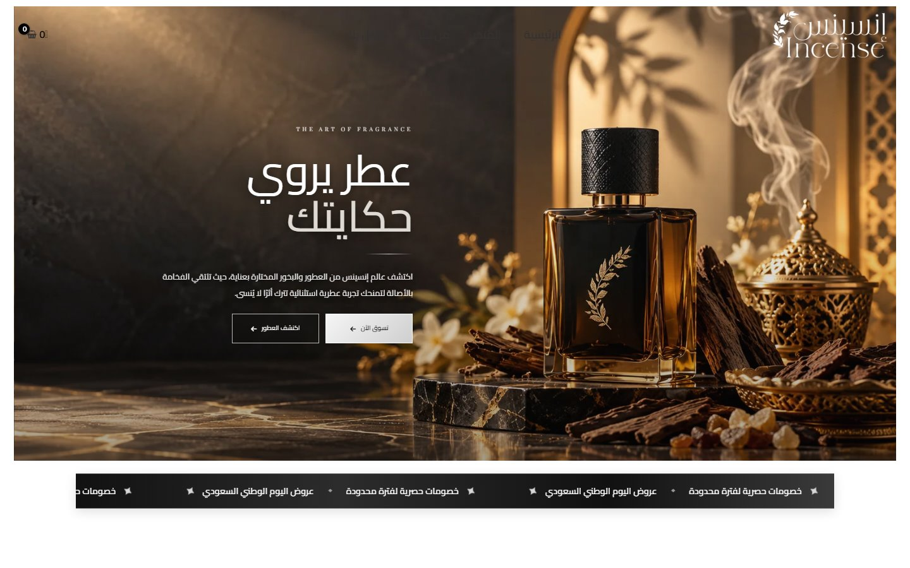<br/>

**Incense — إنسنس** · عطور سعودية فاخرة
<br/><a href="https://incense-sa.com"></a>
</td>
<td width="50%">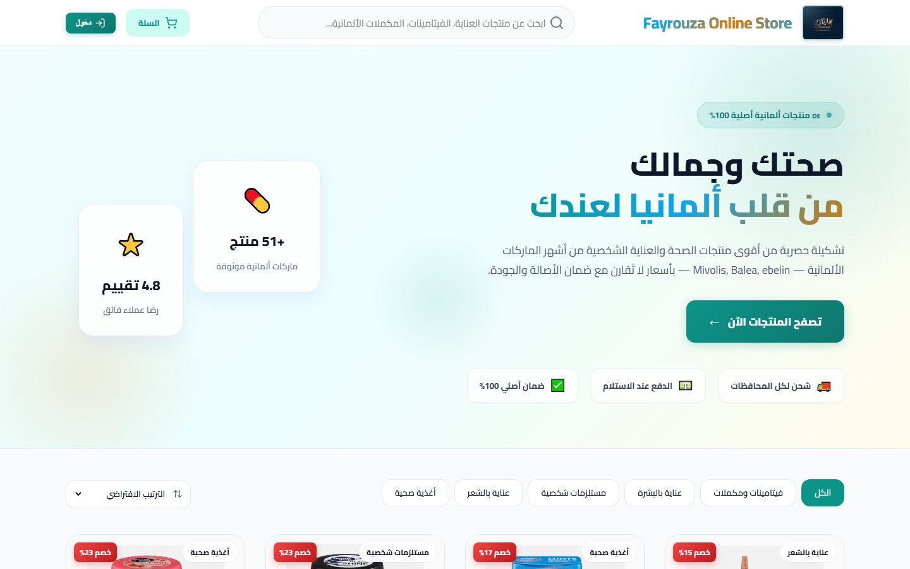<br/>

**Fayrouza Online Store** · منتجات ألمانية
<br/><a href="https://webapplication-lovat.vercel.app"></a>
</td>
</tr>
</table>

<details>
<summary><b>📂 كل المشاريع (35) — اضغط للعرض</b></summary>

<br/>

| | المشروع | النوع | التقنيات |
|---|---|---|---|
| 📱 | [QuickIn](https://github.com/HEMASAMIR/Freelancer_app) | موبايل · منشور | Flutter · Supabase · BLoC |
| 🌐 | [Manara](https://github.com/HEMASAMIR/MANASA_WEB) | ويب · SaaS | Next.js · Supabase |
| 📱 | رفيق المسلم | موبايل · منشور | Flutter |
| 📱 | [مترو مصر](https://github.com/HEMASAMIR/metro_masr) | موبايل · منشور | Flutter · Gemini AI · Hive |
| 🤖 | [Blue Square OCR](https://github.com/HEMASAMIR/ENG-SALEH) | نظام صناعي | Python · OCR · Redis |
| 🌐 | [ZONA Store](https://github.com/HEMASAMIR/suria_website) | متجر + لوحة أرباح | Next.js · TypeScript |
| 📱🌐 | [Incense](https://github.com/HEMASAMIR/insins) | تطبيق + متجر · لايف | Flutter |
| 📱 | [الأديب](https://github.com/HEMASAMIR/Aladeeb) | تعليمي | Flutter · BLoC |
| 🌐 | [Fayrouza Store](https://github.com/HEMASAMIR/Online_store) | متجر · لايف | Next.js |
| 📱 | Deutsche Welt App | تعليم ألماني · مصر والخليج وألمانيا | Flutter |
| 🌐 | [Deutsche Welt Academy](https://github.com/HEMASAMIR/DW-WEBSITE) | منصة تعليمية | Next.js · Django |
| 📱 | [Goal Zone](https://github.com/HEMASAMIR/Goal-zone) | متجر | Flutter · Cubit |
| 📱 | [Delivery Platform](https://github.com/HEMASAMIR/Delivary-Applocation-) | توصيل | Flutter · Socket.IO · Maps |
| 📱 | [Check Auto](https://github.com/HEMASAMIR/check_car) | صيانة سيارات | Flutter · Supabase |
| 📱 | [Food Delivery Suite](https://github.com/HEMASAMIR/Graduation_application) | 3 تطبيقات | Flutter · Firebase |
| 📱 | [Vortexa Supermarket](https://github.com/HEMASAMIR/supermarket) | سوبرماركت | Flutter · BLoC |
| 📱 | [Price Tracker](https://github.com/HEMASAMIR/noun) | متتبع أسعار | Flutter · WorkManager |
| 📱 | [Docdoc](https://github.com/HEMASAMIR/shefaa_app) | طبي | Flutter · Retrofit |
| 📱 | [ShopEase](https://github.com/HEMASAMIR/ecommerce_app) | متجر | Flutter · BLoC |
| 📱 | [Facebook Clone](https://github.com/HEMASAMIR/face_book_clone) | سوشيال | Flutter · Firebase |
| 🌐 | [Herr Mogahed](https://github.com/HEMASAMIR/herr_abdallah_mogahed) | تعليمي | Next.js |
| 📱 | [Bookly](https://github.com/HEMASAMIR/BooklyApp) | كتب | Flutter · Dio |
| 📱 | [Market Admin](https://github.com/HEMASAMIR/Market_admin) | إدارة متجر | Flutter · Bloc |
| 📱 | [Fire Shop](https://github.com/HEMASAMIR/fire_ecco_nabil) | متجر | Flutter · Firebase |
| 📱 | [Socially](https://github.com/HEMASAMIR/social_clone) | سوشيال | Flutter · Provider |
| 📱 | [مصروفي](https://github.com/HEMASAMIR/masrofy) | مالي | Flutter · Hive |
| 📱 | [Notes](https://github.com/HEMASAMIR/note_app) | ملاحظات | Flutter · Hive |
| 📱 | [Live Forecast](https://github.com/HEMASAMIR/liveForecast) | طقس | Flutter · Dio |
| 📱 | [Live Maps](https://github.com/HEMASAMIR/google_maps_public) | خرائط | Flutter · Google Maps |
| 📱 | [Sh3bann Sports](https://github.com/HEMASAMIR/sports_application) | رياضي | Flutter · Supabase |
| 🎨 | [Quran](https://github.com/HEMASAMIR/quran) · [BMI](https://github.com/HEMASAMIR/Bmi_Calculator) · [Points Counter](https://github.com/HEMASAMIR/points_counter) · [Auth UI](https://github.com/HEMASAMIR/signin-signup-flutter-ui) · [Onboarding](https://github.com/HEMASAMIR/flutter_introduction_screen) · [Drawer](https://github.com/HEMASAMIR/flutter_drawer) | تدريبات UI | Flutter |

</details>

---

## 🗂️ Project structure

```text
├── index.html          # الصفحة (كل السكاشن)
├── css/style.css       # التصميم — tokens للوضع الفاتح والداكن + RTL
├── js/data.js          # الترجمة (عربي / English) + الخدمات + خطوات العمل
├── js/projects.js      # ⭐ كل المشاريع — هنا بتضيف أو تعدّل مشروع
├── js/main.js          # المنطق: الرندر، الفلاتر، المعرض، اللغة والثيم
├── assets/img/         # صور المشاريع والأغلفة
├── assets/readme/      # صور الـ README
└── app-ads.txt         # ⚠️ ملف AdMob — لازم يفضل في الـ root
```

## ➕ إضافة مشروع جديد

افتح `js/projects.js` وانسخ أي object وعدّله:

```js
{
  id: 'my-app', cat: ['mobile'], live: true, device: 'phone', accent: '#2563eb',
  shots: ['assets/img/my-app-1.jpg', 'assets/img/my-app-2.jpg', 'assets/img/my-app-3.jpg'],
  title:    { ar: 'اسم التطبيق', en: 'App name' },
  kicker:   { ar: 'وصف قصير',   en: 'Short tagline' },
  desc:     { ar: 'وصف كامل…',   en: 'Full description…' },
  features: { ar: ['ميزة 1', 'ميزة 2'], en: ['Feature 1', 'Feature 2'] },
  tags: ['Flutter', 'Firebase'],
  links: { appstore: '…', play: '…', site: '…', github: '…' },
},
```

| `device` | بيتعرض إزاي |
|---|---|
| `phone` | 3 موبايلات بإطار — لسكرينشوتات الموبايل |
| `poster` | صور المتجر الطويلة (زي صور App Store) |
| `tablet` | تابلت / آيباد |
| `browser` | نافذة متصفح — لسكرينشوتات المواقع |
| `art` | غلاف جاهز full-bleed (`cover`) |
| `logo` · `portrait` | لوجو على كارت أبيض · صورة شخصية |

## 💻 التشغيل محلياً

مفيش أي install — افتح `index.html` في المتصفح على طول، أو:

```bash
npx serve .        # أو: python -m http.server
```

## 🌐 النشر

الريبو ده `HEMASAMIR.github.io`، فـ **GitHub Pages** بينشره تلقائياً على
**https://hemasamir.github.io** مع كل push على `main`.

---

<div align="center">

### 💼 عندك فكرة؟ يلا نبدأ

<a href="https://wa.me/201055673184"></a>
<a href="mailto:01055673184hs@gmail.com"></a>
<a href="https://www.linkedin.com/in/ibrahim-sameer-8b3987241"></a>
<a href="https://github.com/HEMASAMIR"></a>


</div>
